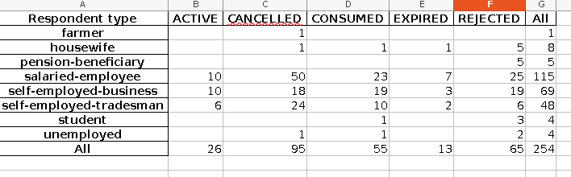
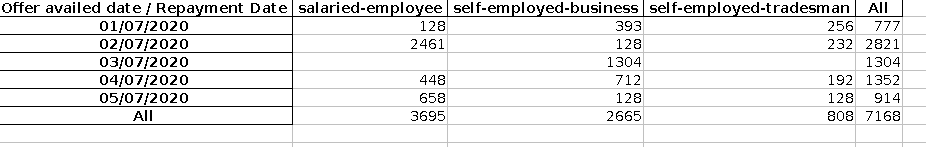
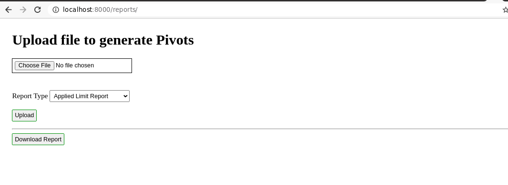
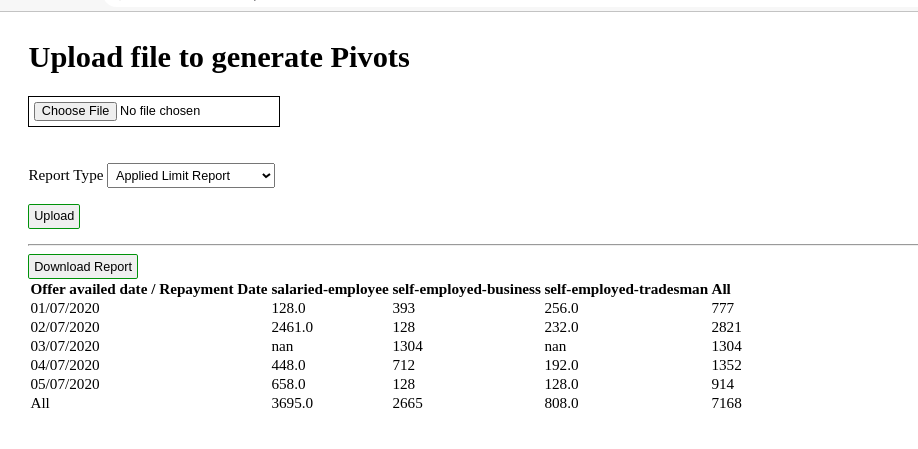

# Reports - Pivot Generation

Sample code that asks user to upload files and generate pivots for reports.

Right now only below reports are supported
 - Applied Limit Report
 - Loan Repayments Report
 
 These reports have below columns available
 - Applied Limit Report
    - Id Card Number	
    - Name
    - Family Name	
    - Date of Birth	Gender	
    - Address
    - App Language
    - Account Creation date
    - Account Creation time
    - Limit Request date
    - Limit Request time
    - Limit Status	
    - Credit Scoring Method
    - Respondent type	
 
For this report pivot is generated 'Respondent type vs Limit Status'

- Loan Repayments Report
    - Id Card Number	
    - Name
    - Family Name	
    - Date of Birth	Gender	
    - Address
    - App Language
    - Account Creation date
    - Account Creation time
    - Limit Request date
    - Limit Request time
    - Loan Status	
    - Credit Scoring Method
    - Respondent type
    - Loan acceptance date	
    - Loan acceptance time	
    - Loan amount	
    - Availed offer
    - Offer availed date / Repayment Date
    - Repaid amount
    	
For this report pivot is generated for Repayment Date vs Repaid Amount vs Respondent type
   

 **Running Application**
 
 For running this application on your local firs clone this repository on your machine.
 
 After setting up python environment run below command to start environment
 
 `python3 manage.py runserver`
 
 On browser hit below URL
 `http://localhost:8000/reports/`
 
 You will be presented with UI like below
 
 
 
 From Choose File Menu choose report against which you want to generate pivots. Also select Report type and then press Upload button.
 
 Once pivots will be generated, summary will be presented on screen.
 
  
  
 Same report will be available to download with added pivots.